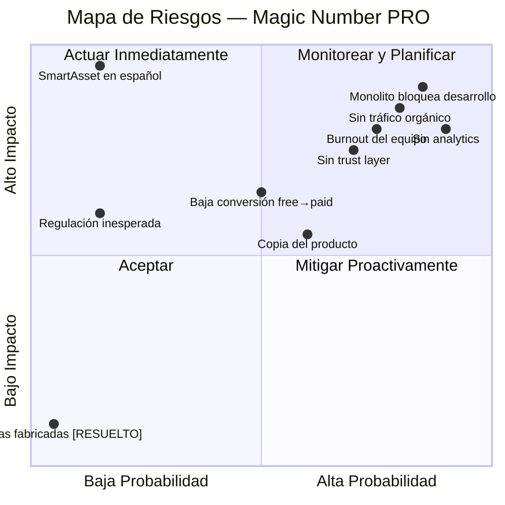
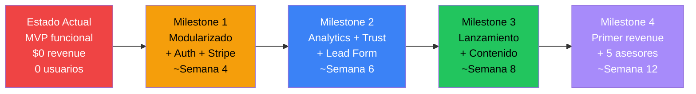

# 🎯 Magic Number PRO — Informe Estratégico 360°

### Auditoría Integral para el Equipo Fundador

**Fecha:** 27 de Marzo de 2026  
**Última actualización:** 27 de Marzo de 2026 — Post ejecución Fase 0 (deploy a producción completado)  
**Metodología:** Análisis multidimensional + FODA actualizado + Matriz de Riesgos + Scorecard de Madurez  
**Alcance:** Código fuente completo, landing page, arquitectura, documentación estratégica, posicionamiento competitivo

---

## Resumen Ejecutivo

Magic Number PRO es un producto con **un motor financiero excepcionalmente sofisticado** y una **tesis de negocio validada por la existencia de SmartAsset** ($1B+ valuación), desplegado en una codebase que está en un punto de inflexión crítico: lo suficientemente bueno para demostrar el concepto, pero estructuralmente inadecuado para monetizar. 

El proyecto tiene **cuatro fortalezas de clase mundial** (motor financiero, costo operativo, sin carga regulatoria, multi-mercado) y **tres debilidades bloqueantes** (monolito JSX, sin autenticación/persistencia, sin analytics) que deben resolverse secuencialmente antes de generar el primer dólar.

> [!IMPORTANT]
> **Veredicto:** El producto tiene potencial real de generar tracción en un mercado desatendido de 580M+ hispanohablantes. Pero la distancia entre el estado actual y la monetización no es trivial — son ~6-8 semanas de desarrollo enfocado antes de poder cobrar $1.

---

## 1. Scorecard de Madurez del Producto

| Dimensión | Score | Nivel | Comentario |
|-----------|:-----:|-------|------------|
| **Motor Financiero** | 9/10 | 🟢 Excelente | Cálculos ajustados por inflación, flujo variable de deuda, 7+ perfiles, year-by-year, reverse calculator, blended portfolio. Muy superior a SmartAsset. |
| **Amplitud Funcional** | 9/10 | 🟢 Excelente | 16 tabs funcionales, score 0-100, benchmarking, costo de oportunidad, cost of inaction, goals, portfolio builder. Feature-completeness impresionante. |
| **UX/UI (App)** | 7/10 | 🟡 Bueno | Light mode premium con design system coherente (Outfit + Inter, tokens CSS, cards glassmorphism). Micro-interacciones sólidas (ANum, Gauge, charts SVG). Pero inline styles dificultan la mantenibilidad. |
| **Landing Page** | 9/10 | 🟢 Excelente | Diseño Binance-inspired con ticker panel animado, hero invertido, CTA fuerte. Bilingüe. ~~Métricas fabricadas~~ → reemplazadas por capacidades verificables del producto. Tips educativos atemporales. Copyright 2026. ✅ *Actualizado Fase 0* |
| **Internacionalización** | 8/10 | 🟢 Muy Bueno | EN/ES completo (~36K EN + ~39K ES = 76K+ de strings). Sistema i18n funcional con Context API. ~~Strings hardcodeadas~~ → 7 instancias corregidas (rental equity, mortgage projections, surplus, earn invested, today's dollars). ✅ *Actualizado Fase 0* |
| **Arquitectura Técnica** | 3/10 | 🔴 Crítico | Archivo monolítico de 1,942 líneas. 55+ useState en un solo componente. Sin state management. Sin routing. Sin code splitting. Deuda técnica severa. |
| **Monetización** | 1/10 | 🔴 No implementado | Sin paywall, sin Stripe, sin auth, sin persistencia. El modelo de negocio está bien diseñado en documentación pero tiene 0% de implementación. |
| **Analytics / Tracking** | 0/10 | 🔴 Inexistente | Sin PostHog, sin eventos, sin funnel tracking. No se sabe dónde abandonan los usuarios. |
| **Seguridad** | 2/10 | 🔴 Mínimo | Sin auth, sin CSP headers, sin política de privacidad funcional. Los datos no se persisten (mitigación involuntaria). ErrorBoundary presente pero básico. |
| **Infraestructura / DevOps** | 5/10 | 🟡 Aceptable | Netlify deployment funcional. Vite build rápido. Git inicializado. Pero sin CI/CD, sin environments separados, sin tests. |
| **SEO** | 5/10 | 🟡 Aceptable | Meta description mejorada. Open Graph + Twitter Card + canonical URL agregados. ✅ *Actualizado Fase 0*. Falta: structured data, sitemap, mini-calculadoras standalone. |
| **Preparación Go-to-Market** | 2/10 | 🔴 Embrionario | Sin contenido para redes, sin red de asesores, sin lead form, sin trust layer. Documentación estratégica excelente pero sin ejecución. |

### Score Global de Madurez: **5.2 / 10** — Pre-MVP monetizable (↑ de 4.8 post Fase 0)

---

## 2. Análisis por Dimensión

### 2.1 🏗️ Dimensión Técnica

#### Fortalezas Técnicas

1. **Motor financiero de primer nivel**
   - `fvVariable()` — proyección año por año con eventos de deuda variable
   - `yearByYear()` — bifurcación acumulación/retiro con perfiles separados
   - `pvA()` — valor presente de anualidad para Magic Number
   - Reverse calculator con binary search (40 iteraciones)
   - Portfolio blended return con ponderación saving/contribution
   - Benchmark contra Federal Reserve Survey of Consumer Finances

2. **Stack moderno y liviano**
   - React 19.1 + Vite 6 → build time sub-1s
   - Zero dependencies externas (sin chart libraries, sin state management)
   - SVG charts custom (MiniChart, MultiLineChart, Gauge) — performance excelente
   - Animated number component (ANum) con cubic easing

3. **I18n bien implementada**
   - Context API propio (`useTranslation` hook)
   - 400+ keys EN/ES con interpolación de variables
   - Landing page con sistema de traducción independiente

#### Debilidades Técnicas Críticas

| # | Debilidad | Impacto | Prioridad |
|---|-----------|---------|-----------|
| **T1** | **Monolito de 1,942 líneas** — `MagicNumberAppMain.jsx` contiene 55+ useState, toda la lógica de negocio, y toda la UI en un solo archivo | Imposibilita A/B testing, code splitting, testing unitario, y trabajo en equipo | 🔴 Bloqueante |
| **T2** | **Inline styles omnipresentes** — ~85% de los estilos están inline en JSX (ej: `style={{fontSize:13,color:"#94a3b8",lineHeight:1.6}}`) | Dificulta theming, responsive, mantenimiento. Duplicación masiva de estilos | 🟠 Alto |
| **T3** | **Sin testing** — 0 tests unitarios, 0 tests de integración, 0 tests de snapshot | Cualquier refactor puede romper cálculos financieros sin detección | 🟠 Alto |
| **T4** | ~~**Strings hardcodeadas**~~ ✅ RESUELTO (Fase 0) — 7 instancias corregidas: rental equity, mortgage projections, high-rate advice, surplus at retirement, today's dollars, extra invested | ~~Experiencia inconsistente~~ → Ahora todo pasa por i18n | ✅ Resuelto |
| **T5** | **Sin routing** — Navegación por estado interno `useState("dashboard")` | No hay deep linking, no hay back button, no hay URLs compartibles | 🟡 Medio |
| **T6** | **Landing y App tienen sistemas de i18n separados** — Landing usa objeto T plano, App usa Context | Duplicación, posible drift de traducciones, el idioma no se sincroniza entre landing y app | 🟡 Medio |
| **T7** | **Variable naming oscuro** — Funciones como `mR`, `fvC`, `fvL`, `pvA`, `gB`, `uE`, `aE`, `rE`, `uD`, `nEId`, `nDId` | Reduce legibilidad para cualquier developer nuevo | 🟡 Medio |

#### Recomendaciones Técnicas

```
Prioridad 1 (Semanas 1-2):
├── Extraer cada tab a su propio componente (16 archivos)
├── Mover estado compartido a Zustand store (1 store, ~55 props)
├── Escribir tests para financial.js (funciones puras, fácil de testear)
└── Eliminar strings hardcodeadas restantes

Prioridad 2 (Semanas 3-4):
├── Implementar React Router (rutas por tab)
├── Migrar inline styles a clases CSS (módulos o styled)
├── Unificar sistema de i18n (landing + app)
└── Error tracking (Sentry free tier)
```

---

### 2.2 🎨 Dimensión Estética y UX

#### Fortalezas

1. **Design system coherente** — Variables CSS bien organizadas (`--cyan`, `--bg-surface`, `--shadow-card`), tokens de radii, sombras y transiciones
2. **Tipografía premium** — Outfit (display) + Inter (body) vía Google Fonts. Pesos bien seleccionados
3. **Micro-animaciones** — `fadeSlideIn`, `barGrow`, gauge con SVG animado, number counter con easing cúbico
4. **Carta de colores inteligente** — Codificación por color (verde=positivo, rojo=riesgo, azul=informativo, ámbar=advertencia) consistente en toda la app
5. **Landing page profesional** — Layout Binance-inspired, ticker animado con jitter, gradientes cyan→purple, hero impactante

#### Debilidades

| # | Debilidad | Impacto |
|---|-----------|---------|
| **E1** | **Mobile responsive incompleto** — El ticker panel se oculta completamente en mobile (`display: none`), perdiendo el elemento diferenciador | Pérdida de impacto en ~60% del tráfico potencial |
| **E2** | **Densidad informativa excesiva** — Tabs como Retirement (líneas 1001-1155) y Achieve (1294-1417) muestran demasiada información sin progressive disclosure | Overwhelm del usuario, posible abandono |
| **E3** | **Sin onboarding guiado** — El dashboard vacío solo tiene un botón "Start". No hay wizard, no hay tutorial, no hay progreso visible | Alto abandono en first-time experience |
| **E4** | **CTAs de asesor sin destino** — Los botones de `AdvisorCTA` hacen `e.preventDefault()` y no llevan a ningún lado. El usuario hace click y no pasa nada | Frustración, pérdida de credibilidad |
| **E5** | **Sin dark mode toggle** — Se migró de dark a light mode pero no hay opción de alternar | Preferencia de usuario no respetada |
| **E6** | **Backgrounds con rgba de dark mode** — Algunas instancias de `background:"rgba(0,0,0,0.15)"` y `"rgba(0,0,0,0.2)"` en componentes Save y Earn. *Nota: la mayoría de los rgba oscuros están en cards de resultados que funcionan correctamente como contraste sutil.* | Impacto visual menor en la mayoría de los casos |

#### Recomendaciones UX

> [!TIP]
> **Quick Win de alto impacto:** Implementar un wizard de 3 pasos (edad → ingresos/gastos → objetivo de retiro) que reemplace el dashboard vacío. Esto solo requiere re-ordenar contenido existente, no crear features nuevos.

---

### 2.3 💰 Dimensión de Negocio y Modelo Económico

#### Fortalezas del Modelo

1. **Dual revenue stream** — B2C (paywall $14.99-$49.99) + B2B (leads a asesores $75-$200/lead). SmartAsset solo tiene B2B
2. **Psicología de precio validada** — $14.99 vs. un Magic Number de $1M+ = 0.001% del objetivo
3. **Sin carga regulatoria** — No maneja dinero, no es broker, no necesita licencias
4. **Costo operativo near-zero** — Cloudflare/Netlify free tier + Supabase free → <$50/mes
5. **Lead de altísima calidad** — Usuario auto-calificado con Score, gap, perfil de inversión, meses de emergencia

#### Debilidades del Modelo

| # | Debilidad | Severidad |
|---|-----------|-----------|
| **N1** | **$0 de revenue generado hasta la fecha** — Todo el modelo es teórico | 🔴 Crítico |
| **N2** | **Sin validación de willingness-to-pay** — Ningún usuario real ha pagado $14.99 aún. La psicología del precio es hypothéticamente sólida pero no probada | 🔴 Crítico |
| **N3** | **Red de asesores = 0** — El motor principal de revenue (B2B) no tiene supply side. Sin asesores, el CTA es un dead-end | 🔴 Crítico |
| **N4** | **Mercado hispanohablante elegido pero producto actual en inglés primero** — La documentación identifica LATAM como mercado principal, pero el flujo prioriza launch en inglés | 🟠 Contradicción estratégica |
| **N5** | **Competencia de productos gratuitos** — Calculadoras de jubilación gratuitas abundan (aunque ninguna con esta profundidad) | 🟡 Medio |

#### Unit Economics Proyectados (Hipotéticos)

```
Escenario: 10K usuarios/mes, 3% conversión, 5% lead rate

B2C:
  10,000 × 3% × $14.99 = $4,497/mes
  
B2B:
  10,000 × 5% × $100/lead = $50,000/mes
  
Total potencial: ~$54,500/mes

Costo operativo: ~$200/mes (hosting, auth, analytics)
Margen bruto: ~99.6%
```

> [!WARNING]
> Estos números asumen tráfico que aún no existe. El primer desafío no es el modelo — es la adquisición de usuarios. Sin inversión en contenido/SEO, el tráfico orgánico será cercano a 0.

---

### 2.4 📢 Dimensión Comunicacional y Marketing

#### Fortalezas

1. **Hook viral natural** — *"El 85% no sabe su Número Mágico. El mío me dejó en shock"* — formato probado en finanzas personales
2. **Viaje emocional bien diseñado** — Curiosidad → Revelación → Urgencia → Esperanza → Acción. Documentado y coherente
3. **Bilingüe desde el diseño** — Landing EN/ES con traducciones profesionales. No es "traducción de Google"
4. **Copy de no-pánico** — El diseño del momento de revelación del MN neutraliza la reacción negativa. Esto es sofisticado

#### Debilidades

| # | Debilidad | Impacto |
|---|-----------|---------|
| **C1** | **Zero presencia en redes** — No hay cuenta de TikTok, Instagram, Twitter, YouTube | Sin canal de distribución |
| **C2** | ~~**Social proof falso**~~ ✅ RESUELTO (Fase 0) — Métricas reemplazadas por capacidades verificables: "16 módulos de análisis", "7+ perfiles de inversión", "Score de salud 0-100", "10 min", "15+ categorías" | ~~Riesgo de reputación~~ → Eliminado |
| **C3** | ~~**Noticias fabricadas**~~ ✅ RESUELTO (Fase 0) — Ticker ahora muestra tips educativos atemporales verificables sobre interés compuesto, fondos indexados y movimiento FIRE | ~~Desconfianza~~ → Contenido siempre verdadero |
| **C4** | ~~**Copyright © 2025**~~ ✅ RESUELTO (Fase 0) — Actualizado a © 2026 | ~~Negligencia percibida~~ → Resuelto |
| **C5** | **Sin testimonios reales** — Ni de usuarios ni de asesores | Falta de trust |
| **C6** | **CTA copy con claim falso** ✅ RESUELTO (Fase 0) — "Miles de personas ya calcularon su Número Mágico" → "Descubrí exactamente cuánto necesitás para tu retiro" | ~~Riesgo de credibilidad~~ → Eliminado |

> [!NOTE]
> ~~**El uso de métricas fabricadas en la landing page era el riesgo comunicacional más serio del proyecto.**~~ ✅ **RESUELTO el 27 de Marzo de 2026.** Todas las métricas, noticias y claims fabricados fueron reemplazados por indicadores de capacidad verificables y tips educativos atemporales. Deploy a producción completado.

---

### 2.5 🏪 Dimensión de Mercado

#### Oportunidades de Mercado

| Oportunidad | TAM | Competencia | Urgencia |
|-------------|-----|-------------|----------|
| Hispanohablantes sin planificación financiera | 580M personas, 85% sin MN calculado | **Prácticamente nula** en herramientas de profundidad en español | 🟢 Alta — ventana de oportunidad |
| FIRE movement LATAM | Creciente, post-pandemia | Blogs, pero sin herramientas | 🟢 Alta |
| Asesores financieros sin leads digitales | Industria global de $200B+ | SmartAsset (USA only) | 🟢 Alta |
| SEO calculadoras financieras en español | Alto volumen, baja competencia | Calculadoras básicas sin profundidad | 🟡 Media |

#### Riesgos de Mercado

1. **SmartAsset expande a español** — Probabilidad baja pero impacto catastrófico. Mitigación: velocidad de ejecución
2. **Aversión cultural al pago en LATAM** — Mitigado por psicología del ancla ($14.99 vs $1M+), pero real
3. **Volatilidad macro LATAM** — Inflación alta puede reducir interés en planificación a 25 años

---

### 2.6 🔒 Dimensión de Seguridad

| Aspecto | Estado | Riesgo |
|---------|--------|--------|
| HTTPS/TLS | ✅ Netlify provee por defecto | Bajo |
| Datos en tránsito | ✅ Todo es client-side, nada se envía a servidor | Bajo |
| Datos en reposo | ⚠️ localStorage no utilizado → datos se pierden al recargar. Sin cifrado | Bajo (no persiste) |
| Autenticación | 🔴 Inexistente | Alto (cuando se implemente paywall) |
| CSP Headers | 🔴 No configurados | Medio |
| Política de Privacidad | 🔴 Links de footer van a `#` — no existe | Alto (requerimiento legal) |
| Términos y Condiciones | 🔴 No existen | Alto (requerimiento legal) |
| Dependencias | ✅ Mínimas (solo react, react-dom, vite, plugin-react) → superficie de ataque baja | Bajo |
| XSS/Injection | ✅ React escapa valores por defecto. Sin `dangerouslySetInnerHTML` detectado | Bajo |
| GDPR/LGPD compliance | 🔴 Sin framework de consentimiento. Landing carga Google Fonts (transferencia de datos a Google) | Alto para EU/Brasil |

> [!IMPORTANT]
> **Antes de cobrar dinero o capturar emails, es OBLIGATORIO tener:** Política de Privacidad real, Términos y Condiciones, consent banner para cookies/fonts, y cumplimiento básico de GDPR (si se apunta a España/EU).

---

### 2.7 ⚙️ Dimensión de Implementación y Operaciones

| Aspecto | Estado | Evaluación |
|---------|--------|------------|
| Deployment | Netlify con auto-deploy | ✅ Funcional |
| Build pipeline | Vite build (sub-1s) | ✅ Excelente |
| CI/CD | No configurado | 🟡 Pendiente |
| Monitoring | Ninguno | 🔴 Ausente |
| Documentación técnica | Parcial (lessons.md, todo.md) | 🟡 Básica |
| Documentación estratégica | Extensa (FODA, Deck FA, Plan Estratégico, Análisis Competitivo) | ✅ Excelente |
| Gestión de proyecto | Manual (todo.md + lessons.md) | 🟡 Funcional pero limitada |
| Tamaño del equipo | Estimado: 1-2 personas | ⚠️ Cuello de botella para ejecución paralela |

---

## 3. Matriz FODA Actualizada (Marzo 2026)

### 💪 Fortalezas

| # | Fortaleza | Impacto en el negocio |
|---|-----------|----------------------|
| F1 | Motor financiero de clase mundial — cálculos que ninguna calculadora gratuita iguala | **Diferenciación radical** vs competencia |
| F2 | Costo operativo near-zero (<$50/mes en producción) | **Runway casi infinito** en fase de validación |
| F3 | Sin carga regulatoria — no maneja dinero | **Velocidad de lanzamiento** + zero compliance cost |
| F4 | Multi-mercado desde el diseño (EN/ES, 76K+ i18n) | **Opción de mercado** sin re-build |
| F5 | Dominios estratégicos asegurados (`magic-number.app` + `minumeromagico.com`) | **Branding protegido** en ambos idiomas |
| F6 | Documentación estratégica exhaustiva | **Claridad de dirección** — raro en startups pre-revenue |
| F7 | 16 tabs funcionales con lógica completa | **Producto terminado** (MVP), no idea ni mockup |
| F8 | Lead de altísima intención (Score + MN + gap + perfil) | **Valor 10x** vs lead frío de SmartAsset |
| F9 | Landing page de nivel profesional con ticker animado | **Primera impresión premium** — no parece un side project |

### ⚠️ Debilidades

| # | Debilidad | Bloqueante para... |
|---|-----------|---------------------|
| D1 | Monolito JSX de 1,942 líneas | Cualquier desarrollo futuro |
| D2 | Sin auth, sin persistencia, sin paywall | Monetización |
| D3 | Sin analytics / funnel tracking | Optimización |
| D4 | CTA de asesor sin destino real | Credibilidad + revenue B2B |
| ~~D5~~ | ~~Métricas fabricadas en landing page~~ ✅ RESUELTO Fase 0 | ~~Reputación~~ → Eliminado |
| D6 | Sin trust layer (privacidad, T&C, badges) | Conversión en LATAM |
| D7 | Inline styles en ~85% del código | Mantenibilidad |
| D8 | Algunos backgrounds con rgba dark-mode residuales (menor) | Coherencia visual (impacto menor) |
| D9 | Sin tests automatizados | Confiabilidad de cálculos |

### 🚀 Oportunidades

| # | Oportunidad | Ventana temporal |
|---|-------------|------------------|
| O1 | Mercado virgen de calculadoras financieras profundas en español | 12-18 meses antes de que aparezca competencia comparable |
| O2 | Asesores financieros hambrientos de leads digitales | Inmediata — la industria no tiene alternativas |
| O3 | Tendencia global de auto-educación financiera (FIRE, TikTok Finance) | Pico actual — hay que capitalizar ahora |
| O4 | SEO de nicho con mínima competencia | 6-12 meses de ventana |
| O5 | Co-creación con influencers financieros hispanohablantes | Inmediata — varios creators con audiencia y sin herramienta |
| O6 | Potencial de adquisición (NuBank, BBVA, NerdWallet) | 18-24 meses si se alcanzan métricas |
| O7 | Psicología del ancla para conversión ($14.99 vs $1M+ MN) | Permanente — inherente al producto |

### 🔴 Amenazas

| # | Amenaza | Probabilidad | Impacto | Mitigación |
|---|---------|:----------:|:------:|------------|
| A1 | SmartAsset lanza en español | Baja | Catastrófico | Velocidad de ejecución |
| A2 | Copia del concepto por fintechs LATAM | Media | Alto | Moat: SEO + red de asesores + brand |
| A3 | Resistencia cultural al pago en LATAM | Media | Medio | Pricing local, Mercado Pago |
| A4 | Desconfianza en plataformas financieras desconocidas | Alta | Alto | Trust layer obligatoria pre-lanzamiento |
| A5 | Burnout del equipo (1-2 personas para todo) | Alta | Alto | Priorización agresiva, contratación de freelancer para frontend |

---

## 4. Matriz de Riesgos Cuantificada



| # | Riesgo | Prob. | Impacto | Score | Mitigación propuesta | Responsable |
|---|--------|:-----:|:------:|:-----:|----------------------|-------------|
| R1 | **Monolito bloquea todo el build futuro** | 🔴 85% | 🔴 9/10 | **76** | Modularización en las próximas 2 semanas. No tocar paywall hasta completar. | Tech Lead |
| R2 | **Sin tráfico orgánico al lanzar** | 🔴 80% | 🔴 8.5/10 | **68** | 30 videos TikTok/Reels pre-lanzamiento. 3 mini-calculadoras SEO standalone. | Marketing |
| R3 | **Sin analytics = optimización ciega** | 🔴 90% | 🔴 8/10 | **72** | PostHog Day 1 con eventos pre-definidos: completion rate por tab, tiempo en paywall, CTA clicks | Tech Lead |
| R4 | **Burnout del equipo fundador** | 🟠 75% | 🔴 8/10 | **60** | Contratar freelancer React ($2-3K) para modularización. Founder se enfoca en GTM. | CEO |
| R5 | **Sin trust layer = alta abandono en LATAM** | 🟠 70% | 🟠 7.5/10 | **52** | Privacidad real, T&C, badges SSL, copy "no guardamos datos de cuenta" → Sprint 2 | Legal + Tech |
| ~~R6~~ | ~~**Métricas fabricadas descubiertas**~~ ✅ RESUELTO | ~~40%~~ 0% | ~~7/10~~ 0 | **0** | ✅ Reemplazadas por capacidades verificables ("16 módulos", "7+ perfiles", "Score 0-100"). Desplegado a producción 27/Mar/2026. | Completado |
| R7 | **Baja conversión (<2%)** | 🟡 50% | 🟠 6.5/10 | **32** | A/B test precio ($9.99 vs $14.99 vs $19.99). Validar con 500 usuarios antes de optimizar | Growth |
| R8 | **SmartAsset en español** | 🟢 15% | 🔴 9.5/10 | **14** | Speed of execution. Dominar SEO español antes. | CEO |
| R9 | **Copia por fintechs** | 🟡 60% | 🟡 5.5/10 | **33** | Moat = brand + SEO + red de asesores, no el código | CEO + Marketing |
| R10 | **Regulación inesperada** | 🟢 15% | 🟠 6/10 | **9** | Review legal básico. Disclaimers ya presentes en la app. | Legal |

---

## 5. Gap Analysis — De Donde Estamos a Donde Necesitamos



### Brechas Críticas (ordenadas por prioridad de resolución)

| # | Brecha | Estado Actual | Estado Necesario | Esfuerzo Estimado |
|---|--------|---------------|------------------|-------------------|
| 1 | Modularización del código | 1 archivo de 1,942 líneas | 16+ archivos de componentes, 1 store, 1 router | 40-60 horas |
| 2 | Autenticación de usuarios | Ninguna | Email magic link o Google OAuth (Clerk/Supabase) | 8-12 horas |
| 3 | Persistencia de datos | 0 (se pierde al recargar) | Supabase Postgres para perfiles de usuario | 12-16 horas |
| 4 | Paywall | Inexistente | Blurred MN + emotional CTA + no-panic copy | 16-20 horas |
| 5 | Pagos | Inexistente | Stripe Checkout ($14.99 Unlock / $49.99 PRO) | 8-12 horas |
| 6 | Analytics | 0 eventos | PostHog con 15+ eventos definidos | 4-6 horas |
| 7 | Trust layer | 0 | Privacidad, T&C, badges, copy de seguridad | 8-12 horas |
| 8 | Lead form asesor | CTA va a `#` | Form real → Airtable/HubSpot | 6-8 horas |
| 9 | Contenido de distribución | 0 piezas | 30 videos TikTok + 3 mini-calculadoras SEO | 40+ horas |
| 10 | Red de asesores | 0 asesores | 5 asesores piloto con pitch ROI | 20+ horas de outreach |

**Estimación total a primer revenue: ~200-250 horas de trabajo** (8-12 semanas a tiempo completo para 1 developer + 1 business/marketing person)

---

## 6. Plan de Acción Priorizado

### ✅ Inmediato — COMPLETADO (27 de Marzo de 2026)

- [x] **Reemplazar métricas fabricadas** → Badges: "16 módulos", "7+ perfiles", "0-100 score". Stats: "10 min", "3 escenarios", "15+ categorías". CTA honesto.
- [x] **Actualizar copyright** → © 2026 en footer
- [x] **Corregir strings hardcodeadas** → 7 instancias en inglés migradas a i18n (en.js + es.js)
- [x] **Reemplazar noticias fabricadas** → Tips educativos atemporales en ticker (interés compuesto, fondos indexados, FIRE)
- [x] **Agregar Open Graph + Twitter Card** → 8 meta tags en index.html
- [x] **Deploy a producción** → https://magic-number-mn.netlify.app (build exitoso, 41 modules, sin errores)

### 🟠 Sprint 1-2 (Semanas 1-4)

- [ ] **Modularización** — Extraer tabs a componentes individuales
- [ ] **Zustand store** — Migrar 55+ useState a store central
- [ ] **Tests para financial.js** — Las funciones matemáticas son puras, perfectas para testing
- [ ] **PostHog** — Implementar con eventos pre-definidos desde Day 1

### 🟡 Sprint 3-4 (Semanas 5-8)

- [ ] **Auth** — Supabase Auth o Clerk
- [ ] **Persistencia** — Guardar perfil de usuario en Supabase
- [ ] **Paywall** — Implementación con seguridad backend
- [ ] **Stripe** — Checkout para Tier 1 ($14.99) y Tier 2 ($49.99)
- [ ] **Trust layer** — Privacidad real, T&C, badges
- [ ] **Lead form** — Form funcional → Airtable

### 🟢 Sprint 5-6 (Semanas 9-12)

- [ ] **Contenido TikTok/Reels** — 30 videos con el hook del 85%
- [ ] **SEO mini-calculadoras** — 3 standalone pages
- [ ] **Outreach asesores** — 5 piloto con pitch ROI
- [ ] **Mercado Pago** — Pagos en LATAM
- [ ] **Region-awareness** — Parámetros por país (inflación local, edad de jubilación)

---

## 7. Conclusiones y Recomendaciones Finales

### Lo que está bien (para NO cambiar):

1. **El motor financiero es world-class** — No lo toquen, solo testéenlo
2. **La tesis del emotional trigger es brillante** — El viaje del usuario está perfectamente diseñado
3. **El modelo de dual revenue (B2C + B2B) es superior a SmartAsset** — La estructura es correcta
4. **La landing page es premium** — ✅ Métricas reales, copyright corregido, tips educativos, OG tags. Lista para compartir.
5. **El enfoque en el mercado hispanohablante es correcto** — 580M personas sin alternativa

### Lo que debe cambiar urgentemente:

1. ~~**Eliminar métricas fabricadas**~~ ✅ COMPLETADO — Riesgo reputacional eliminado
2. **Modularizar el código** — Sin esto, todo lo demás es imposible o extremadamente frágil ← 🔴 PRÓXIMO
3. **Implementar analytics desde Day 1** — Sin datos, no pueden optimizar nada
4. **No lanzar sin trust layer** — En LATAM la desconfianza mata productos financieros

### Recomendación estratégica global:

> [!IMPORTANT]
> **El mayor riesgo de Magic Number PRO no es la competencia ni el modelo de negocio — es la velocidad de ejecución.** El producto funcional existe. La documentación estratégica es de primer nivel. Pero la distancia entre "funciona en localhost" y "cobra dinero" es de ~250 horas de trabajo enfocado. Con un equipo de 1-2 personas, eso son 3 meses. El mercado hispanohablante no va a esperar para siempre.
>
> **Recomendación: considerar seriamente contratar un freelancer React senior ($3-5K) para ejecutar la modularización y el paywall en 3-4 semanas, mientras el equipo fundador se enfoca en GTM (contenido, asesores, SEO).** La inversión se paga con los primeros 300-400 usuarios pagos.

---

## Changelog

### Fase 0 — 27 de Marzo de 2026 (Completada y desplegada a producción)

| Cambio | Archivo(s) | Resultado |
|--------|-----------|----------|
| Métricas fabricadas → capacidades reales | `LandingPage.jsx` | Badges: "16 módulos", "7+ perfiles", "0-100 score". Stats: "10 min", "3 escenarios", "15+ categorías" |
| Noticias fabricadas → tips educativos | `LandingPage.jsx` | Tips atemporales sobre interés compuesto, fondos indexados, y FIRE |
| CTA con claim falso → copy honesto | `LandingPage.jsx` | "Descubrí exactamente cuánto necesitás para tu retiro" |
| Copyright 2025 → 2026 | `LandingPage.jsx` | Footer actualizado |
| 7 strings hardcodeadas EN → i18n | `MagicNumberAppMain.jsx` + `en.js` + `es.js` | Rental equity, mortgage projections, high-rate advice, surplus msg, today's dollars, extra invested |
| Open Graph + Twitter Card + canonical | `index.html` | 8 meta tags para compartir en redes sociales |
| Deploy a producción | Netlify | https://magic-number-mn.netlify.app |

---

*Informe preparado sobre la base de revisión exhaustiva de:*
- *1,942 líneas de código principal (MagicNumberAppMain.jsx)*
- *490 líneas de landing page (LandingPage.jsx)*
- *~1,200 líneas de CSS (index.css + landing.css)*
- *85 líneas de funciones financieras (financial.js)*
- *76K+ de internacionalización (en.js + es.js)*
- *Documentación estratégica completa (Deck FA, FODA, Plan Estratégico, Análisis Competitivo)*
- *Todo.md, lessons.md, package.json, netlify.toml, vite.config.js*

---

**Magic Number PRO tiene todo para ser el SmartAsset del mundo hispanohablante. La pregunta no es "si puede funcionar" — es "si pueden ejecutar lo suficientemente rápido".**
