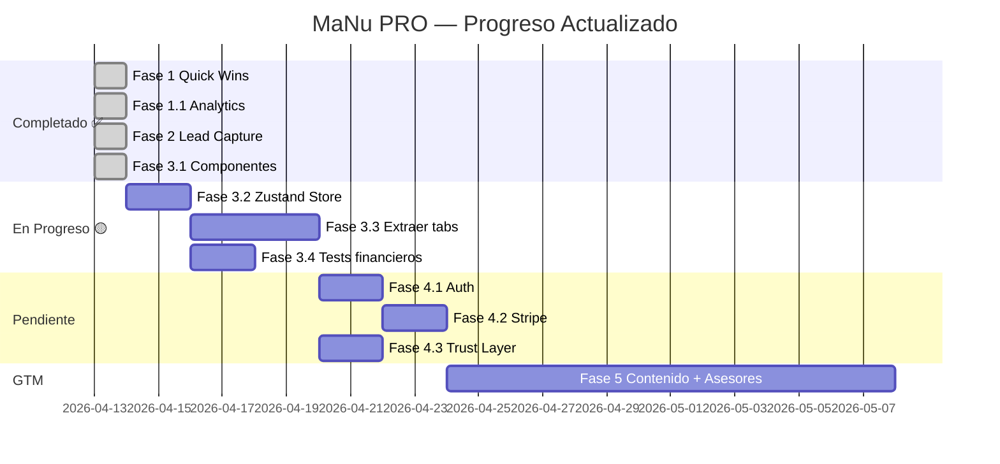

# MaNu PRO — Roadmap (Actualizado 13-Abr-2026, 13:54 ART)

## Estado Actual — Snapshot

| Dimensión | Score | Cambio vs inicio sesión |
|-----------|:-----:|:-----------------------:|
| Motor Financiero | 9/10 | → estable |
| UX/UI | 9/10 | → estable |
| Landing Page | 9.5/10 | → estable |
| i18n (EN/ES) | 8.5/10 | → estable |
| **Arquitectura** | **5.5/10** | ⬆️ +1.5 (9 componentes extraídos) |
| **Analytics** | **6/10** | ⬆️ +6 (de 0 a funcional) |
| **Lead Capture** | **8/10** | ⬆️ +8 (de 0 a producción) |
| **Auth / Payments** | **0/10** | 🔴 sin cambios |
| **Trust Layer (Legal)** | **2/10** | → sin cambios |

**Último deploy**: `1813138` (13-Abr) — Analytics live con Supabase  
**Producción**: https://magic-number.app ✅  
**Revenue**: $0 | **Users**: 0 | **Leads capturados**: 2 (test) | **Eventos trackeados**: ✅ live  
**Supabase**: Proyecto `manu-pro` con 2 tablas (`leads`, `analytics_events`)

---

## Trabajo Completado Hoy (13-Abr) — 8 commits, 6 deploys

### ✅ Fase 1: Quick Wins — COMPLETADA
- [x] Bug 4.3% portfolio → defaults `[1,1,1,1,1,1,1]`
- [x] Rango MN free → `0.85×` a `1.15×` con redondeo $25K
- [x] Emojis → verificado 0 residuales en 2,660 líneas
- [x] Color cyan → fallback `hexToRgb()` unificado a `#0099cc`
- [x] Font-size → ya estaba en 15px (todo.md estaba desactualizado)
- [x] Card glows → 7 variantes revisadas y mantenidas

### ✅ Fase 1.1: Analytics — COMPLETADA (con Supabase)
- [x] Tabla `analytics_events` en Supabase (RLS + índices)
- [x] `analytics.js` reescrito: batching 5s / 20 eventos → Supabase
- [x] 4 eventos instrumentados: `tab_viewed`, `language_changed`, `advisor_cta_clicked`, `lead_submitted`
- [x] Flush automático en `visibilitychange` y `beforeunload`

### ✅ Fase 2: Lead Capture — COMPLETADA
- [x] Supabase proyecto `manu-pro` configurado
- [x] Tabla `leads` con 26 columnas + RLS
- [x] `LeadCaptureModal.jsx` con preview financiero + formulario
- [x] 5 AdvisorCTA conectados al modal
- [x] CSP actualizado para Supabase
- [x] Env vars en Netlify
- [x] Test E2E: 2 leads verificados en producción

### 🟡 Fase 3: Modularización — EN PROGRESO (Paso 1 completado)
- [x] **Paso 1**: 9 componentes inline extraídos a `/components/`
  - AnimatedNumber, NumberInput, SectionTitle, Gauge, Slider, MiniChart, MultiLineChart, AdvisorCTA, NavButtons
  - Monolito: 2,194 → 2,111 líneas | Componentes: 6 → 15
- [ ] **Paso 2**: Zustand store (migrar ~55 useState)
- [ ] **Paso 3**: Extraer tabs a archivos individuales (~1,500 líneas)

---

## Próximas Fases

### Fase 3 — Modularización (restante, ~2-3 sesiones)

> [!WARNING]
> Prerrequisito para auth, payments, y A/B testing. El monolito de 2,111 líneas sigue siendo el principal riesgo técnico.

#### Paso 2: Zustand Store
- Instalar Zustand
- Crear `store/useAppStore.js` con los ~55 `useState` migrados
- Integrar `usePersistedState` con Zustand middleware `persist`

#### Paso 3: Extraer tabs
Cada tab → su propio `.jsx` en `app/src/tabs/`:

| Tab | Líneas aprox. | Complejidad |
|-----|:------------:|:-----------:|
| Achieve (MN) | ~250 | Alta |
| Retire | ~200 | Alta |
| Invest | ~180 | Media |
| Situation | ~150 | Baja |
| Inaction | ~150 | Media |
| Save / Earn / Cost / Goals / Score / Reports | ~600 | Variada |

#### Paso 4: Tests financieros
- `financial.js` → Vitest para `fvVariable`, `yearByYear`, `pvA`, reverse calculator

---

### Fase 4 — Monetización (~2-3 sesiones, post-modularización)

> [!IMPORTANT]
> **Decisión pendiente**: Estructura jurídica (Persona Física MVP vs LLC). Esto impacta Stripe.

- Auth: Supabase Auth (magic link + Google) → conectar al tier "Email"
- Stripe: $14.99 lifetime via Checkout hosted
- Legal: Privacy Policy + ToS + GDPR consent
- Persistencia cloud: localStorage + Supabase sync

---

### Fase 5 — Go-to-Market (ongoing)

- **Contenido**: ~30 videos TikTok/Reels/Shorts con hook del Magic Number
- **SEO**: 3 mini-calculadoras standalone, schema.org FinancialCalculator
- **Red de asesores**: 5 piloto, pitch con data real de leads, $75-$200/lead

---

## Secuencia Propuesta

---

## Infraestructura Actual

| Servicio | Detalle | Costo |
|----------|---------|:-----:|
| **Netlify** | Hosting + deploys | $0 |
| **Supabase** | DB (leads + analytics) | $0 |
| **GitHub** | Repo `mboccacci-blip/MaNu` | $0 |
| **Dominio** | magic-number.app | ~$12/año |
| **Total** | | **$0/mes** |

### Tablas Supabase
| Tabla | Columnas | RLS | Propósito |
|-------|:--------:|:---:|-----------|
| `leads` | 26 | ✅ INSERT anon | Perfil financiero completo por lead |
| `analytics_events` | 9 | ✅ INSERT anon | Eventos de usuario (batched) |

### Eventos Trackeados
| Evento | Datos | Frecuencia esperada |
|--------|-------|:-------------------:|
| `tab_viewed` | tab, lang, tier | ~10/sesión |
| `language_changed` | from, to | ~1/sesión |
| `advisor_cta_clicked` | source_tab | ~0.5/sesión |
| `lead_submitted` | tier, source_tab | ~0.1/sesión |
